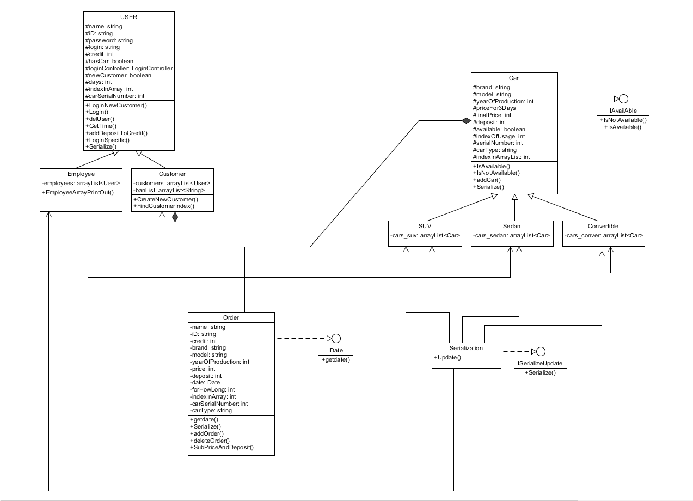

# Požičovňa áut PABT

Požičovňa áut PABT. Cieľom môjho projektu je program, ktorý by sa dal využiť pri prevádzke autopožičovne.  Na začiatku si uživatel určí, či bude ďalej pokračovať ako Employee alebo Customer. 

## Ak ako Customer a ide si vozidlo požičať :

- zadá svoje údaje spolu s Creditom, ktorý má k dispozícii
- na ako dlho si auto požičá
- vypočita sa cena a odráta z Creditu spolu so zálohou 

## Ak ako Customer a ide vozidlo vrátiť :

- zákazník sa identifikuje číslom OP
- zisti sa, či je vozidlo vrátene načas, keď tak penalizácia

## Ak ako Employee :

- zadá heslo (možno pre všetkých zamestnancov rovnaké) a ukáže sa mu zoznam dostupných a požičaných vozidiel

Bezpečnosť -> údaje, ktoré zákazník zadá budú zabezpečené tak, aby sa k ním nedostal nikto cudzí.

Spoľahlivosť -> Pri nedodržaní termínu vrátenia vozidla je osoba penalizovaná.

# 7. týždeň :
- rozchodenie gitu
- pridanie README
- začatie robenie na projekte (dosť neskoro)

# 8. týždeň :
- Pre Customers som pridal 2 view --> NewCustomerView a CustomerView
- Zaregistrovanie New Customer
- Prihlásenie pomocou ID (číslo OP) sa ako Customer (už bude mať objednané auto)
- Prihlásene ako Employee, pomocou zatiaľ spoločného hesla
- Serializacia ide, lenže Deserialiazacia ešte nie

# ODOVZDANIE Č.2

Neviem, ktorý je to ten commit link, tak som radšej dal viac verzií -->

- https://github.com/OOP-FIIT/oop-2020-str-16-b-krizan-xbarantomik/commit/85dab9d137c36500aadc22eb95893aeaafba70ee

- 85dab9d137c36500aadc22eb95893aeaafba70ee

- 85dab9d

 to video --> https://youtu.be/E4jkX4XfOoY

# FINAL ODOVZDANIE - DOKUMENTÁCIA
## Zámer projektu:
Požičovňa áut PABT. Program, ktorý by sa dal využiť pri prevádzke autopožičovne. Uživateľ si môže objednať auto, pozreť si svoju objednavku, prípadne skôršie vrátiť.
Keď sa prihlási zamestnanec, tak má k dispozícii zoznamy všetkých áut, požičaných alebo dostupných áut, zákaznikov a objednávok. A pokial sa prihlási ako Admin tak môže aj pridávať nových zamestnancov.

##   Priebeh programu:
#### Ako zákazník
Ako ID zadám číslo OP, vložím dalšie údaje vrátane sumy, ktorú dám autopožičovni. Vyberiem si z ponuky áut a na ako dlho si chcem auto požičať. Ukáže sa mi zhrnutie objednávky a potvrdím objednanie.
Počas platnej objedávky si môžem skontrolovať svoju objednávku, prípadne ju skôršie vrátiť.
Pokiaľ ho vrátim po určenej dobe, tak sa mi nevráti záloha a moje číslo OP je na tzv BanListe.

#### Ako zamestnanec
Použijem svoj login a heslo na prihlásenie sa do systému. Môžem si prezrieť všetky dostupné zoznamy. Ak ako admin tak môžem aj vytvoriť login a heslo pre nových zamestnancov.

## Zatial zaregistrovaní zamestnanci

    login: login   heslo: a
    login: swf     heslo: leia
    login: swm     heslo: luke
    login: joujou  heslo: bardejou
    ADMIN:
    login: admin   heslo: admin

## Zatial zaregistrovaní zákazníci

    ID: AA123456
    ID: BB123456
    ID: CC123456
    ID: late1
    ID: late2

Tie posledné dva sú na otestovanie prípadu, keď zákazník ide vrátiť auto po stanovenom dátume.

A ešte aj ID: skuska , toto ID je už na Banliste.

## Dorobené veci od prezentovania:
Genericka trieda -> serialization class

RTTI -> v AYSOrderController ked použijem metódu FindCar(), tak potom otestujem  
        vlastnú Exception CheckCarForNull() či nájdene Car není null, pomocou instanceof

Implicitna metoda ->    
- LoginController TryLoginEmployee() 2nd line od vrchu   
- LoginController TryLoginCustomer() 3rd line zo spodu

## Class diagram

## Záver
Možné nápady na dorobenie:
 - Zamestnanec bude môcť pridavať auta
 - Zamestnanec bude mócť odstranovat zákaznikov
 - Zákazník bude môcť vrátiť auto tak, že údaje aj Credit si "nechá" u nás, a pri ďalšiom požičavaní sa už nebude musieť registrovať.

S pozdravom,

Adam Baran-Tomik